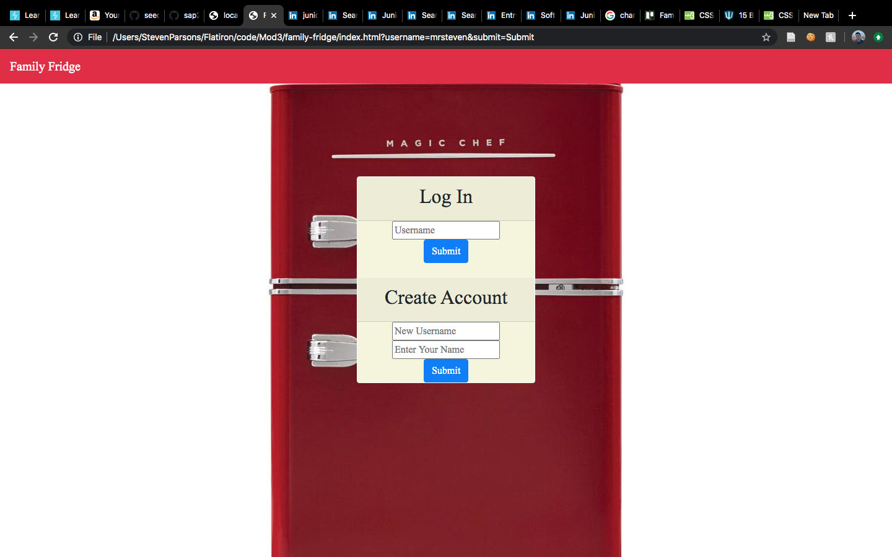
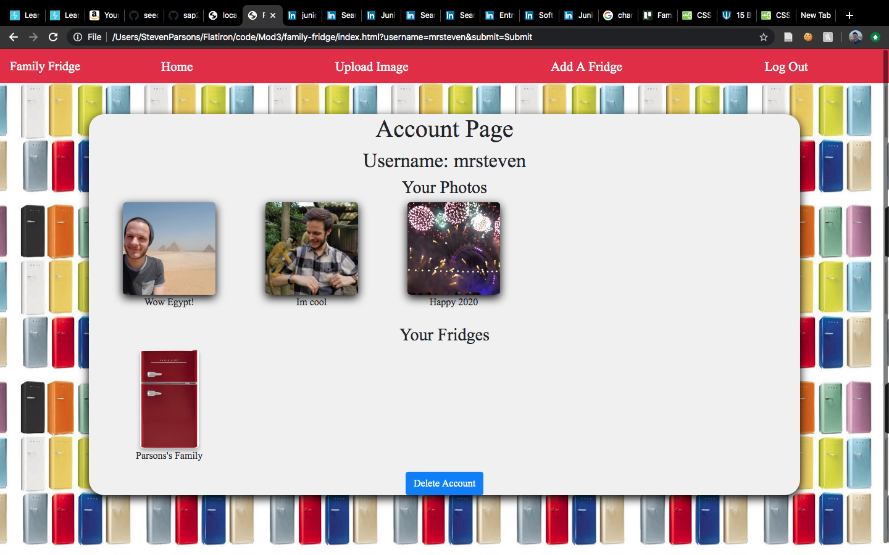
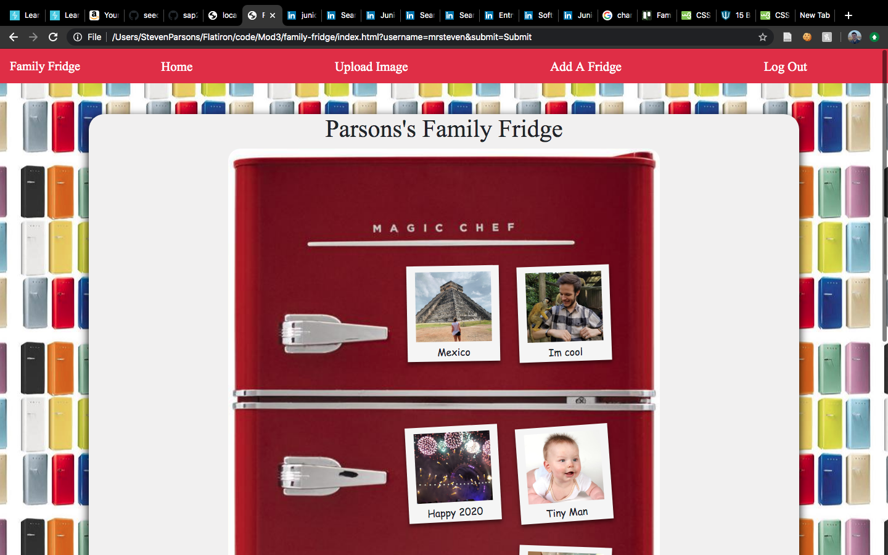
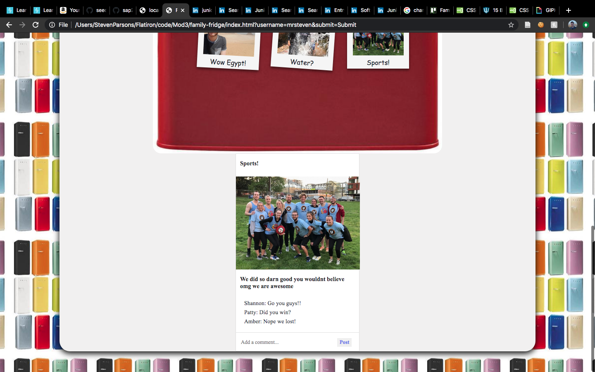
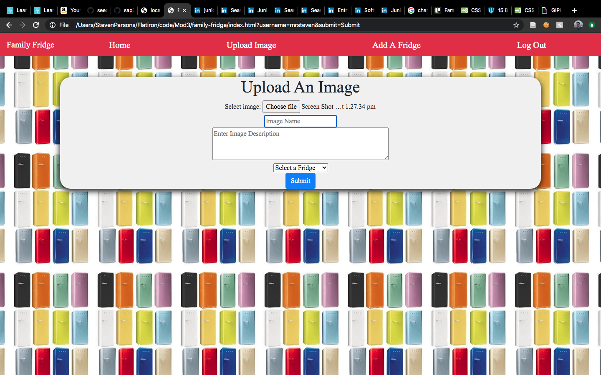
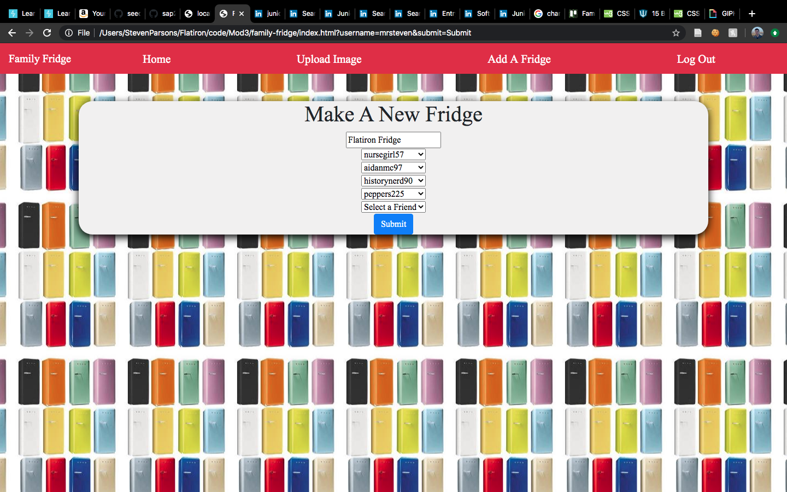

# family-fridge
JS/Rails Project

Family Fridge front-end:
https://github.com/sap2411/family-fridge

Family Fridge Back-end:

Family Fridge 

# Family Fridge - Frontend

Family Fridge is an app for sharing important moments and accomplishments with those you are close with, simulating polaroids on a virtual fridge to bring back that old way of celebrating eachothers achievments from childhood. 

[This](https://github.com/aidanmc95/family-fridge-backend) is a link the the backend repository.

## Motivation

We wanted to create an app that allows familys to conenct in a wholesome way, especially if familys are unable to connect in person during the pandemic, that reminds them of how they would connect in childhood.

## Screenshots
Login

Account Page

Viewing a Fridge

Commenting on a Polaroid

Upload an Image

Create a New Fridge

## Technology Used

- JS
- Rails Router

## Features

Users Can:
- Create an account
- Upload images
- Create fridges and add friends as participants
- Post photos to fridges
- Comment on posts

## Installation

clone the front-end, at the top of index.js change client-id value to your imgur client id, and run 'open index.html'

clone back-end repo, run the following commands in order: bundle install, rails db:migrate, rails db:seed, rails s.

## Contributing

Contributions are welcome, submit a pull request!

## Authors

* **Steven Parsons** - [GitHub](https://github.com/sap24471)
* **Aidan Muller-Cohn** - [GitHub](https://github.com/aidanmc95)

## License

This project is licensed under the [GNU GPL](https://www.gnu.org/licenses/gpl-3.0.en.html)

